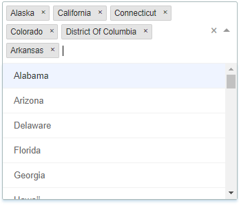

# Drop-down with the list of the states in US



This is a small app built as an exercise for the purpose of Geoblink
recruitment. The app is built with React and react-select librabry by Jed Watson: https://github.com/JedWatson/react-select.  

## How to install?

```
npm install
```
 

## How to run the app?

```
npm start
```
  
The above instruction is combined of two instructions, run concurrently: running
a server which served a JSON with the list of options and the app itself.

  
The server can be also run separately:

```
node data/server.js
```
## How to test the app?
```
npm run cypress
```

I decided to use Cypress as an end-to-end testing tool, because it is simple, does not require any outern dependencies like Selenium. Its syntax reflects that of Mocha and Jest. Thanks to the usage of Chromium it allows to run the test and debug at the same time.

## Why React?

I considered all the three major JS Frameworks for this task: Angular, Vue and
React. I decided to use the last one because it has the following features:

*  it is well-established,
*   has big and vibrant community,
*   is easy to learn,
*   is well-documented,
*   has a good CLI that helps to establish a project in no time,
*   has great debugging support and helpful browser plugins,
*   is easy to test.

Especially I believe that a good learning curve and reliability are the most
important features for a startup like yours.

When it comes to other frameworks, Vue is also promising, but it just needs
slightly more time. It has less ready-to-use plugins than React and slightly
less community. I rejected Angular because it’s complex and may be perceived as
unreliable due to it’s lack of consistency between versions. It’s also the
slowest of all the three frameworks. And although I believe in the importance of
strict type control given by TypeScript, I think it’s not the most important
feature in this case.
